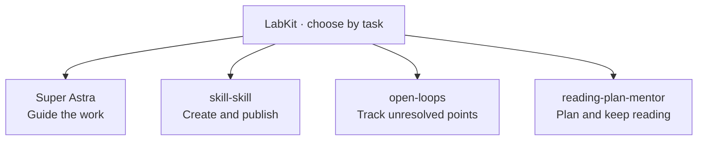

<div align="center">

<picture>
  <source media="(prefers-color-scheme: dark)" srcset="assets/banner-dark.svg">
  
</picture>

**English** · [中文](README.zh-CN.md)

[](https://github.com/haorantang97/LabKit/actions/workflows/super-astra.yml) [](LICENSE) [](#choose-a-skill) [](CONTRIBUTING.md)

[Choose a skill](#choose-a-skill) · [Get started](#get-started) · [Examples](#in-practice) · [Status](#validation-status) · [FAQ](#faq)

</div>

**Give your agent a useful way to work, one skill at a time.**

LabKit is Lab 305's collection of reusable agent skills. Guide an ordinary task, turn a working skill into a well-presented repository, keep unresolved points visible in a long conversation, or build a reading plan that responds to your progress. Each tool has its own entrypoint; install the ones you need.

## Choose a skill

| When you want to… | Use | What it produces |
| --- | --- | --- |
| Apply relevant guidance before an agent starts work | **[Super Astra](skills/super-astra/README.md)** | Task-based selection of configurable Astra prompt modules, with client-specific setup |
| Create, refine or publish an AI skill | **[skill-skill](skills/skill-skill/SKILL.md)** | A scoped skill workflow; for publication, a complete repository with its own identity and documentation |
| Find points that disappeared in a long conversation | **[open-loops](skills/open-loops/SKILL.md)** | An auditable list of unanswered questions, unacknowledged suggestions and decisions made on your behalf |
| Read a booklist with daily guidance | **[reading-plan-mentor](skills/reading-plan-mentor/SKILL.md)** | A paced reading plan, a sample guide and continuity that adapts to actual progress |



These are four independent tools. The diagram is a selection map: using one does not automatically run the others. Publishing steps inside `skill-skill` and prompt modules inside Super Astra belong to their respective tools.

## Get started

In a local agent that can access GitHub and install skills, ask:

> Install the complete skill-skill folder from haorantang97/LabKit for my current client. Preserve any existing customizations and confirm which files were installed.

Replace `skill-skill` with `open-loops` or `reading-plan-mentor` to choose another tool. **Super Astra also needs initialization**; use the prompt and client-specific instructions in its [installation guide](skills/super-astra/README.md#install-and-initialize).

To inspect the collection yourself:

```bash
git clone https://github.com/haorantang97/LabKit.git
cd LabKit
```

Install the complete selected folder under `skills/`, including its references, scripts and assets, in your client's skill directory. A lone `SKILL.md` can leave required resources behind. Each tool's linked entrypoint explains its workflow and dependencies.

Super Astra includes an installer that previews changes before applying them. Follow its [host guide](skills/super-astra/references/hosts.md) for the current client. Hook registration, trust and observed loading are separate steps; installation does not change the model selected in your client.

## In practice

**Make a skill ready for other people.** Give `skill-skill` a working rule and the intended audience. It can refine the skill, explain its use, build a matching visual identity and prepare the repository for the publication work you requested. A local edit stays a local edit; repository preparation follows the [presentation standard](skills/skill-skill/references/repository-presentation.md).

**Recover the missing decisions.** In a long project conversation, ask `open-loops` to account for unresolved points. It distinguishes a question the agent missed, a suggestion you never acknowledged, and a choice made on your behalf. You can then decide what to answer, defer or drop.

**Turn a booklist into a habit.** Give `reading-plan-mentor` your books and available daily time. It checks whether the books support a useful shared theme, builds a realistic pace and shows a sample daily guide. Recurring delivery starts after you approve the plan and delivery setup.

**Choose guidance for the current task.** Super Astra lets the current model select relevant modules for initiative, instruction-following, writing, delegation and testing. Availability does not mean every module runs on every task. Its [module guide](skills/super-astra/README.md#select-by-task-intent) explains the routing and limits.

## Validation status

| Tool | Evidence available | What still depends on your setup |
| --- | --- | --- |
| Super Astra | [Automated script and file-adapter tests](skills/super-astra/references/evaluation.md); dedicated CI badge above | Actual client loading, Hook trust, model availability and module selection |
| skill-skill | Skill format validation and repository presentation checks | Generated output quality, target-agent behavior and the result of any requested publication |
| open-loops | Packaged workflow instructions and supporting resources | Access to the relevant conversation and faithful execution by the host agent |
| reading-plan-mentor | Packaged workflow with references for pacing, continuity and delivery | Book-source accuracy, scheduling and an authorized delivery channel |

The CI badge covers **Super Astra's tests**, not an end-to-end certification of all four tools. Workflow instructions alone do not provide a scheduler, an email connection or client-level guarantees.

## Repository layout

```text
LabKit/
├── README.md · README.zh-CN.md
├── assets/                         # Collection identity and theme variants
├── skills/
│   ├── super-astra/                 # Prompts, setup tools, references and tests
│   ├── skill-skill/                 # Skill authoring and publication entrypoint
│   │   ├── modules/                # Internal publishing steps
│   │   └── references/             # Authoring and presentation standards
│   ├── open-loops/                  # Long-conversation audit
│   └── reading-plan-mentor/         # Reading workflow and references
└── .github/workflows/               # Scoped automated checks
```

## FAQ

**Do I have to install everything?** No. Pick a single top-level tool. Preserve its complete folder so internal references resolve.

**Is LabKit a single agent or a single giant skill?** It is a collection. Each public tool has its own scope; internal publishing steps and prompt blocks do not become extra public tools.

**Does Super Astra work in every agent client?** It provides several host adapters, with distinct validation limits. Its official prompt blocks target Astra; an adapter does not establish model availability or equivalent behavior elsewhere. See the [host guide](skills/super-astra/references/hosts.md).

**Where are the old open-loops and reading-plan-mentor repositories?** The [open-loops repository](https://github.com/haorantang97/open-loops) and [reading-plan-mentor repository](https://github.com/haorantang97/reading-plan-mentor) are archived for history. Their current collection entries are here in LabKit.

**How does this relate to Personal-Ontology and LabArt?** [Personal-Ontology](https://github.com/haorantang97/Personal-Ontology) contains the personal knowledge system and its surrounding tools. [LabArt](https://github.com/haorantang97/LabArt) holds visual and artistic skills. LabKit is the everyday agent toolbox.

## Contributing

See [CONTRIBUTING.md](CONTRIBUTING.md). Keep both README editions aligned, document the actual validation scope, and preserve one public entry per independent tool.

## License

[PolyForm Noncommercial License 1.0.0](LICENSE). Preserve any source attribution included with individual components.
