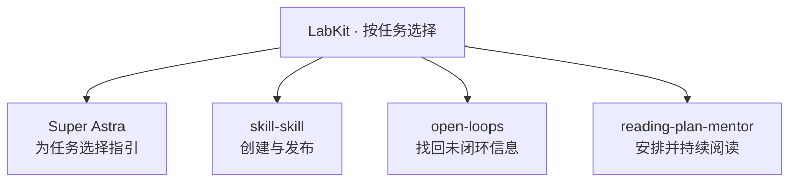

<div align="center">


[English](README.md) · **中文**

[](https://github.com/haorantang97/LabKit/actions/workflows/super-astra.yml) [](LICENSE) [](#选择一个-skill) [](CONTRIBUTING.zh-CN.md)

[选工具](#选择一个-skill) · [开始使用](#开始使用) · [使用示例](#使用示例) · [验证状态](#验证状态) · [FAQ](#faq)

</div>

**给 Agent 一套能用在具体工作里的方法，按需装一个就能开始。**

LabKit 是 Lab 305 的日常 Agent 工具箱：为普通任务选择合适的行为指引，把一个能用的 Skill 整理成完整的仓库，找回长对话里遗漏的问题，或把书单变成能坚持的阅读计划。每个工具都有自己的入口，按需要安装。

## 选择一个 Skill

| 你想做什么 | 使用 | 得到什么 |
| --- | --- | --- |
| 让 Agent 在工作前选择适用的行为指引 | **[Super Astra](skills/super-astra/README.zh-CN.md)** | 按任务选择的 Astra 提示词模块，以及适合当前客户端的初始化流程 |
| 创建、改进或发布 AI Skill | **[skill-skill](skills/skill-skill/SKILL.md)** | 按请求范围完成 Skill 工作；发布时获得品牌与文档完整的仓库 |
| 找回长对话中消失的问题和决定 | **[open-loops](skills/open-loops/SKILL.md)** | 可核对的清单：漏答的问题、未接住的建议，以及 AI 替你做出的选择 |
| 围绕一份书单持续阅读 | **[reading-plan-mentor](skills/reading-plan-mentor/SKILL.md)** | 有节奏的阅读计划、导读样例，以及随实际进度调整的陪读记录 |



这是四个独立工具的选择图。使用一个不会自动运行另外三个。`skill-skill` 里的发布步骤、Super Astra 里的提示词模块，都属于各自工具内部。

## 开始使用

在可以访问 GitHub、安装 Skills 的本地 Agent 中，可以直接说：

> 从 haorantang97/LabKit 给我当前客户端安装完整的 skill-skill。保留已有自定义内容，并确认实际安装了哪些文件。

把 `skill-skill` 换成 `open-loops` 或 `reading-plan-mentor`，即可选择其他工具。**Super Astra 还需要初始化**，请使用其[安装指南](skills/super-astra/README.zh-CN.md)里的提示和对应客户端说明。

如果想先查看仓库：

```bash
git clone https://github.com/haorantang97/LabKit.git
cd LabKit
```

把 `skills/` 下选中的完整文件夹放进客户端的 Skill 目录，保留其中的 references、scripts 和 assets。只复制 `SKILL.md` 可能漏掉运行所需的材料。各工具入口包含具体流程与依赖说明。

Super Astra 提供先预览、再应用的安装工具。按它的[客户端指南](skills/super-astra/references/hosts.md)选择配置方式。Hook 注册、信任与实际加载需要分别确认；安装不会改变客户端当前选用的模型。

## 使用示例

**让一个 Skill 能交给别人用。** 把现有规则和目标读者交给 `skill-skill`。它可以改进 Skill、说明使用方法、建立匹配的视觉形象，再完成你要求的仓库发布工作。局部修改按局部范围处理；仓库包装遵循[展示标准](skills/skill-skill/references/repository-presentation.md)。

**找回项目里遗漏的决定。** 在一段长项目对话里，让 `open-loops` 对账。它会区分 Agent 没回答的问题、你尚未接住的建议，以及 AI 替你做出的决定。接着由你判断哪些要回答、暂缓或放弃。

**把书单变成持续阅读。** 给 `reading-plan-mentor` 一份书单和每天可用的时间。它先判断这些书能否围绕一个有价值的问题共读，再安排现实的节奏，给出一天的导读样例。计划和投递设置经你确认后，才开始定期投递。

**为当前任务选择指引。** Super Astra 让当前模型按需要选取主动推进、指令遵循、写作、委派和测试模块。启用一个模块不代表每项任务都会使用它。[模块说明](skills/super-astra/README.zh-CN.md)介绍了选择方式与边界。

## 验证状态

| 工具 | 已有验证依据 | 仍取决于你的环境 |
| --- | --- | --- |
| Super Astra | [脚本与文件适配器自动化测试](skills/super-astra/references/evaluation.md)，对应顶部独立 CI 徽章 | 客户端实际加载、Hook 信任、模型可用性与模块选择 |
| skill-skill | Skill 格式校验与仓库展示检查 | 生成内容质量、目标 Agent 行为，以及所请求发布的实际结果 |
| open-loops | 已打包的流程指令与配套资源 | 相关对话是否可读取、宿主 Agent 是否忠实执行 |
| reading-plan-mentor | 阅读节奏、连续性和投递相关的流程及参考资料 | 书籍事实准确性、定时能力和已授权的投递通道 |

顶部 CI 徽章只覆盖 **Super Astra 的测试**，不代表四个工具都完成了端到端认证。流程指令本身不提供定时器、邮件连接或客户端级保证。

## 仓库结构

```text
LabKit/
├── README.md · README.zh-CN.md
├── assets/                         # 工具箱品牌与明暗主题
├── skills/
│   ├── super-astra/                 # 提示词、初始化工具、参考资料与测试
│   ├── skill-skill/                 # Skill 创建和发布入口
│   │   ├── modules/                # 内部发布步骤
│   │   └── references/             # 编写与仓库展示标准
│   ├── open-loops/                  # 长对话对账
│   └── reading-plan-mentor/         # 阅读流程与参考资料
└── .github/workflows/               # 按范围运行的自动化检查
```

## FAQ

**必须全部安装吗？** 不需要。选一个顶层工具即可，安装时保留完整文件夹，让内部引用能够找到对应文件。

**LabKit 是一个 Agent，还是一个大 Skill？** 它是工具合集。每个公开工具有各自的范围，内部发布步骤和提示词模块不会变成额外的公开入口。

**Super Astra 在每个 Agent 客户端里都能用吗？** 它提供多种宿主适配，但各有验证边界。官方提示词面向 Astra；适配器不等于对应模型可用，也不保证在其他模型上有相同效果。详见[客户端指南](skills/super-astra/references/hosts.md)。

**原来的 open-loops 和 reading-plan-mentor 仓库去哪了？** [open-loops 原仓库](https://github.com/haorantang97/open-loops)与[reading-plan-mentor 原仓库](https://github.com/haorantang97/reading-plan-mentor)已归档，用于保留历史。当前合集入口在 LabKit。

**和 Personal-Ontology、LabArt 有什么关系？** [Personal-Ontology](https://github.com/haorantang97/Personal-Ontology)承载个人知识系统与配套工具；[LabArt](https://github.com/haorantang97/LabArt)收录视觉与艺术创作 Skills；LabKit 收录日常 Agent 工具。

## 参与贡献

见 [CONTRIBUTING.zh-CN.md](CONTRIBUTING.zh-CN.md)。同步维护中英文首页，说明实际验证范围，并让每个独立工具保持一个公开入口。

## 许可证

[PolyForm Noncommercial License 1.0.0](LICENSE)。保留各组件随附的来源声明。
